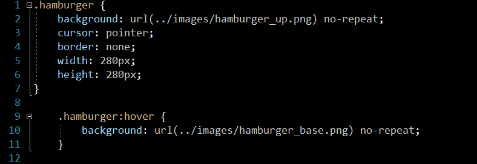

Blazor Img Button  Readme

Stewart Hyde

Introduction
============

I wanted to have graphic images on buttons, and I look over the internet and with Blazor, I could not find exactly what I wanted.  But with the advancement of .Net CSS isolation feature, I found it was simple. Basically, what I did was that I made a custom CSS file for razor component and for each image, I gave it different name and provided hover image to switch the image.
For the button, it a simple html button 

<button @onclick="OnClickImg" class="@Name"></button>

And the following is example for Hamburger in my example.

 
The following is example of screen shot from the example.  Hover image is transparent

A couple of things I ran into that I am wondering about to make it more generic.
1.	I was required to make 2 separate CCS entries in the file. It would be nice to be able to past down the paths for different images.
2.	I had to make the size of image the same as on the screen. 
3.	CSS file must reside in component directory and not where razor client is at.
